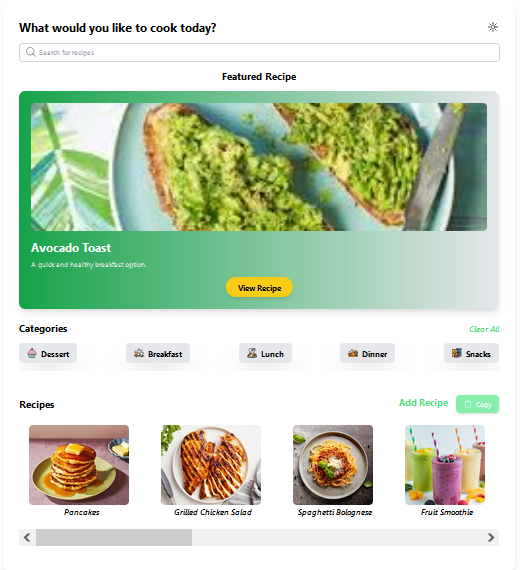
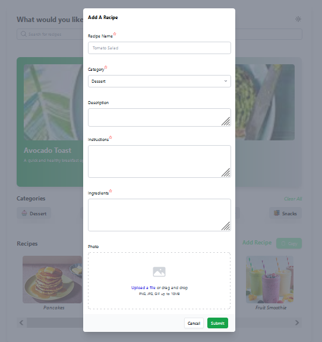
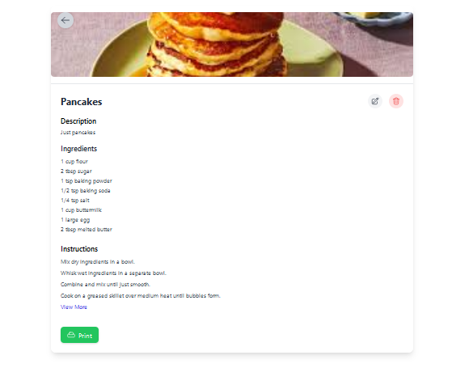
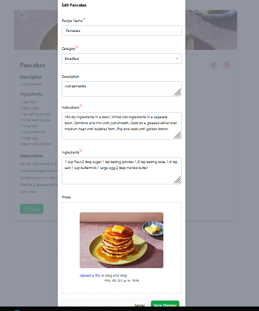
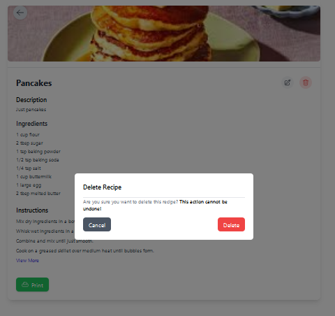
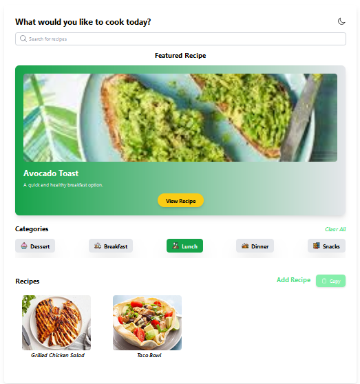
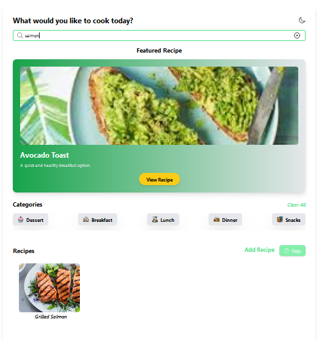

# Recipe Tracker Application

Welcome to the Recipe Tracker Application! This is a simple React application that allows you to manage and search for recipes.

## Brief Description

The Recipe Tracker Application is a web-based application that helps users store, organize, and search for recipes. Users can create, edit, and delete recipes, and filter them based on various criteria such as category, ingredients, or cooking time.

## Installation and Running the Application

1. Clone the repository:
   > `git clone https://github.com/your-username/recipe-tracker.git`
2. Navigate to the project directory:
   > `cd recipe-tracker`
3. Install the dependencies:
   > `npm install`
4. Start the development server: > `npm start`
5. Open your web browser and navigate to `http://localhost:5173` to access the application.

### Screenshots of the Application

- Recipes List
  > 

- Adding a Recipe
  > 

- View Recipe
  > 

- Edit Recipe
  > 

- Delete a Recipe
  > 

- Filter by Category
  > 

- Search for a Recipe
  > 
